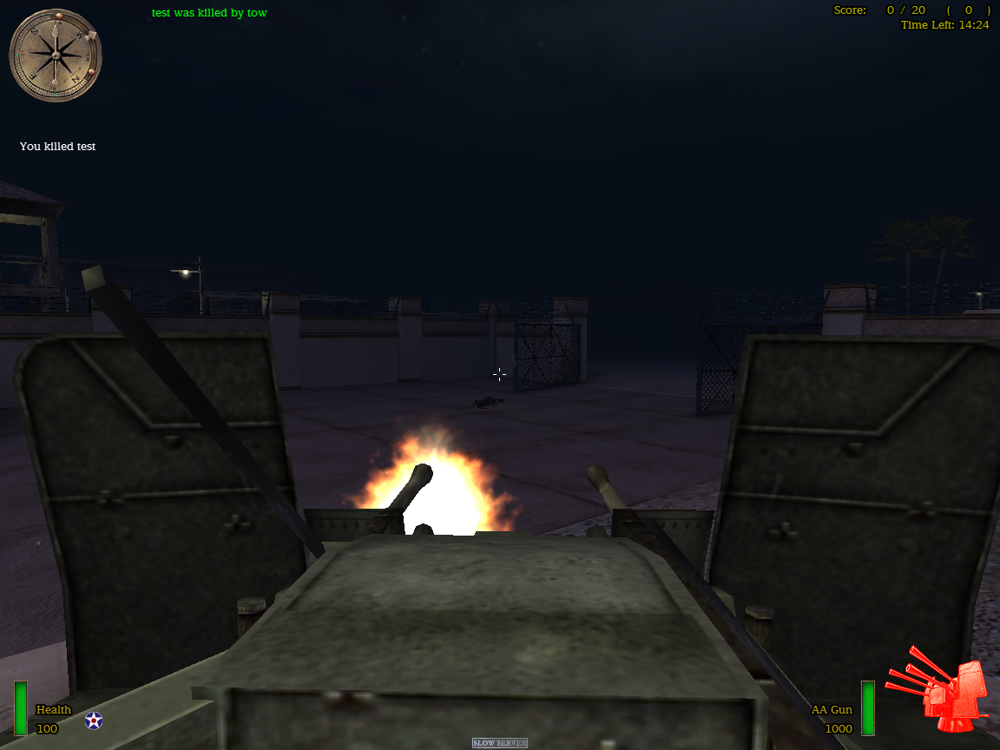
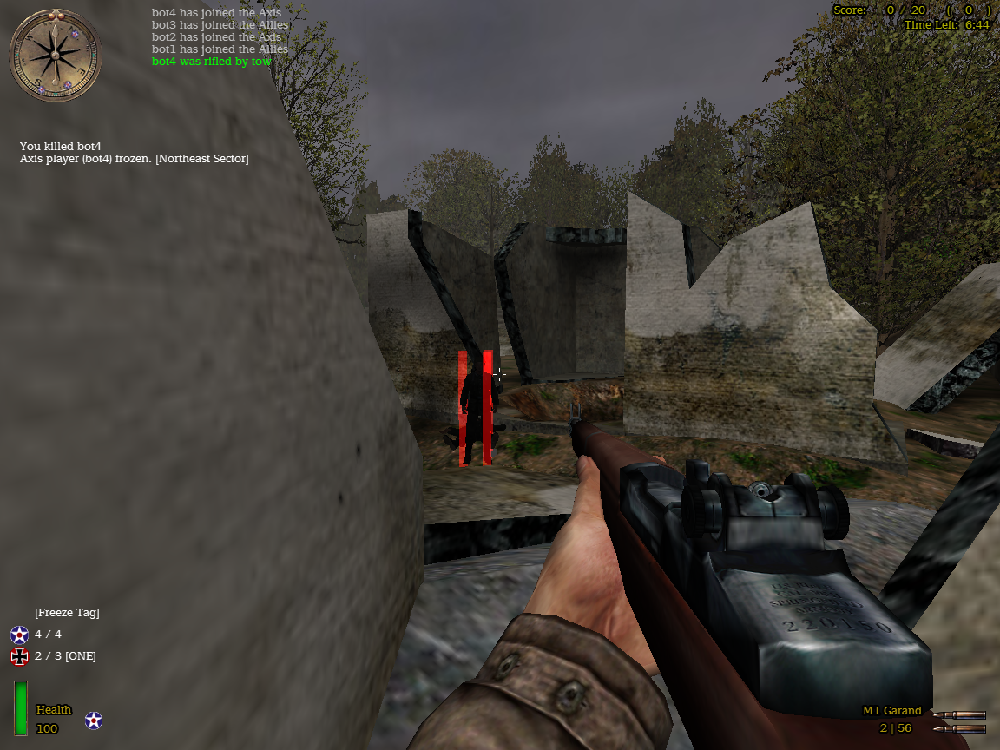

# OpenMoHAA

 [](https://github.com/openmoh/openmohaa/releases) [](https://github.com/openmoh/openmohaa/releases)

 


```
     / _ \ _ __   ___ _ __ |  \/  |/ _ \| | | |  / \      / \
    | | | | '_ \ / _ \ '_ \| |\/| | | | | |_| | / _ \    / _ \
    | |_| | |_) |  __/ | | | |  | | |_| |  _  |/ ___ \  / ___ \
     \___/| .__/ \___|_| |_|_|  |_|\___/|_| |_/_/   \_\/_/   \_\
          |_|
```

## Current State

OpenMoHAA is still under development. The single-player campaign is not yet functional due to AI not being fully stable. But the `training` map can be played from start to end. The current focus is on multiplayer.

## Intro

The main goal of OpenMoHAA is to ensure the future and continuity of **Medal of Honor: Allied Assault**. It has always been a dream in the community to provide patches and security fixes for the game. Thanks to the ioquake3 project, F.A.K.K SDK and other quality tools, OpenMoHAA has already reached more than half of its goal: to create an open-source version of MoH:AA (based on version 2.40) that is fully compatible with the original game (in terms of protocol, assets, and scripts).

## Running

Ensure that you download the binaries compatible with your platform.

### Requirements

You may need to install Microsoft Visual C++ 2015/2017/2019/2022 Redistributable from https://learn.microsoft.com/en-US/cpp/windows/latest-supported-vc-redist?view=msvc-170

### Client

a) extract archive to your MOHAA installation directory.

-or-

b) extract archive somewhere on your hard drive, create a shortcut to openmohaa (or omohaaded), and set the start directory to your MOHAA installation directory.

### Server

Extract the archive to your MOHAA server installation directory. Then proceed like you would do with mohaa server:

- `.\omohaaded.exe +exec server.cfg` on Windows
- `./omohaaded +exec server.cfg` on Linux


### Config file

The config file can be found in different locations depending on the platform:

- `%APPDATA%\openmohaa\<game_name>\configs\omconfig.cfg` on Windows
- `~/.openmohaa/<game_name>/configs/omconfig.cfg` on Linux

This has two advantages:
- On a multi-user system, each user will have their own configuration file
- It doesn't overwrite the existing MOHAA configuration in the MOHAA installation directory.

### Game selection

**Medal of Honor: Allied Assault Spearhead** and **Medal of Honor: Allied Assault Breakthrough** are supported in OpenMoHAA using the `com_target_game` variable. To play an expansion, append the following command-line arguments to the executable:

- `+set com_target_game 1` for Spearhead (mohaas/mohta)
- `+set com_target_game 2` for Breakthrough (mohaab/mohtt)

On Windows, you can create a shortcut to OpenMoHAA with these command-line arguments.
The default value of `com_target_game` is 0 for the base game (main).

With `com_target_game`, OpenMoHAA will support the network protocol accordingly.

You can now start a local OpenMOHAA server or play on a server.

### Playing with bots

OpenMoHAA has a basic bot system that emulates real players. The maximum number of bots is defined by the `sv_maxbots` variable, and the number of initial bots is defined by the `sv_numbots` variable. Bots can also be added or removed using the `addbot` and `removebot` commands.

This feature is a great way to test the gameplay and mods.

## Builds

### Server

The server version can be built successfully, but some features are not functional. For example, the Actor system is almost fully implemented, but it is not yet stable. This means that Actor may not work as expected and could cause crashes.

Overall, the server and the fgame components are almost fully implemented, but they may not be completely stable. There could be some minor bugs (and rare crashes), but the game should be playable.

### Client

The client version of OpenMoHAA has undergone partial implementation, with the cgame module being nearly completed. Credits to the SDK of **Heavy Metal: F.A.K.K. 2** both the cgame and fgame modules.

The current operational status for each component is as follow:

| Component               | Full | Almost | Half | Early | Bad | Not working | Comment                                                           |
|-------------------------|------|--------|------|-------|-----|-------------|-------------------------------------------------------------------|
| Audio                   |      |        |      |       | x   |             | Very basic implementation from Quake III                          |
| CG Module               |      | x      |      |       |     |             | Missing FX, Marks and decals                                      |
| Client                  |      | x      |      |       |     |             | Missing GameSpy, server list, binds, map picker, ...              |
| Collision               | x    |        |      |       |     |             |                                                                   |
| Model/TIKI/Skeletor     | x    |        |      |       |     |             |                                                                   |
| Renderer                |      | x      |      |       |     |             | Missing ghost, marks, sphere lights, sky portal, sun flare, swipe |
| Server                  |      | x      |      |       |     |             | Probably a few bugs remaining                                     |
| Server module (fgame)   |      | x      |      |       |     |             | Actor, and few gameplay bugs                                      |
| UI                      |      |        | x    |       |     |             | Has core features only (menu, widgets, console, hud, urc loading) |

## Compiling

OpenMoHAA supports any architecture, thanks to the CMake build system and cross-platform code/libraries. While the most common little-Endian architectures (arm, aarch64, x86, x86_64) have been tested and confirmed to work, big-Endian architectures should be supported as well; however, they remain untested.

The following tools are required for all platforms:
- CMake >= 3.5
- Flex (>= 2.6.4) and Bison (>= 3.5.1)
- A C++11 compiler is also required.

The installation directory can be set to the MOHAA directory.

By default, the build will produce both the client and dedicated server versions. The client can be omitted from the build by appending `-DBUILD_NO_CLIENT=1` to the CMake command-line arguments. Using this parameter will result in only the server portion being built.

### Linux

These are the tools required on Linux :
- Clang >= 3.3 or GCC >= 4.8.5
- libsdl2-dev

**clang-3.5** and **gcc-4.8.5** should work (tested on Ubuntu 16.04), but the latest version should be used.

Ubuntu 20.04 is the minimum version required to fully compile the project successfully.

1 line install command with clang:
```sh
sudo apt-get install -y cmake ninja-build clang lld flex bison libsdl2-dev
```

Example with **CMake** and **ninja-build** installed:
```sh
mkdir .cmake && cd .cmake
cmake -G Ninja ../
```

Other compilers can be specified by appending `-DCMAKE_C_COMPILER=/path/to/compiler -DCMAKE_CXX_COMPILER=path/to/compiler` to the CMake command-line.

### Windows

Visual Studio (2019 or 2022) is generally preferred.

Flex and Bison can be downloaded from here: https://github.com/lexxmark/winflexbison/releases/tag/v2.5.25

Append `-DFLEX_EXECUTABLE=...\win_flex.exe -DBISON_EXECUTABLE=...\win_bison.exe` to the CMake command-line to use the package from the link above.

## Screenshots

|                                                                                   |                                                                            |
|-----------------------------------------------------------------------------------|----------------------------------------------------------------------------|
|                                       |                                |
|                                    |                             |
|   |     |

*More screenshots [here](docs/images)*

## Features

### Features added and not present in MOH:AA

#### Server-side

- Bots
- Spectate players in first-person
- Demo recording
- More script commands for mods
- Non-PVS optimization

##### Non-PVS optimization

For each client, the server optimizes by only sending them information about other players that they can see. Clients won't see other players they can't see.

Enable this feature with `set sv_netoptimize 2`.

#### Client-side and server-side

- Security fixes and features from ioquake3
- IPv6 support (from ioquake3)

### Objectives / planned features

This is a non-exhaustive list of objectives and planned features.

#### Server-side

- 100% compatibility with mohaa content
- More feature for mods
- Anticheat
- Stats system
- Multiple roles/abilities for server admins to reduce password-stealing

## Third party

### SDL

http://www.libsdl.org/

### OpenAL

https://www.openal.org/

### LibMAD

http://www.underbit.com/products/mad/

### cURL

https://curl.se/

### Libogg

https://github.com/gcp/libogg

### Libvorbis

https://xiph.org/vorbis/

### Libopus

https://opus-codec.org/

## Communities

### URLs

- https://github.com/openmoh/openmohaa/
- https://mohaaaa.co.uk/AAAAMOHAA/index.php
- https://x-null.net/

### Discord

[](https://discord.gg/NYtH58R)
