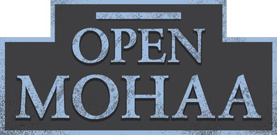
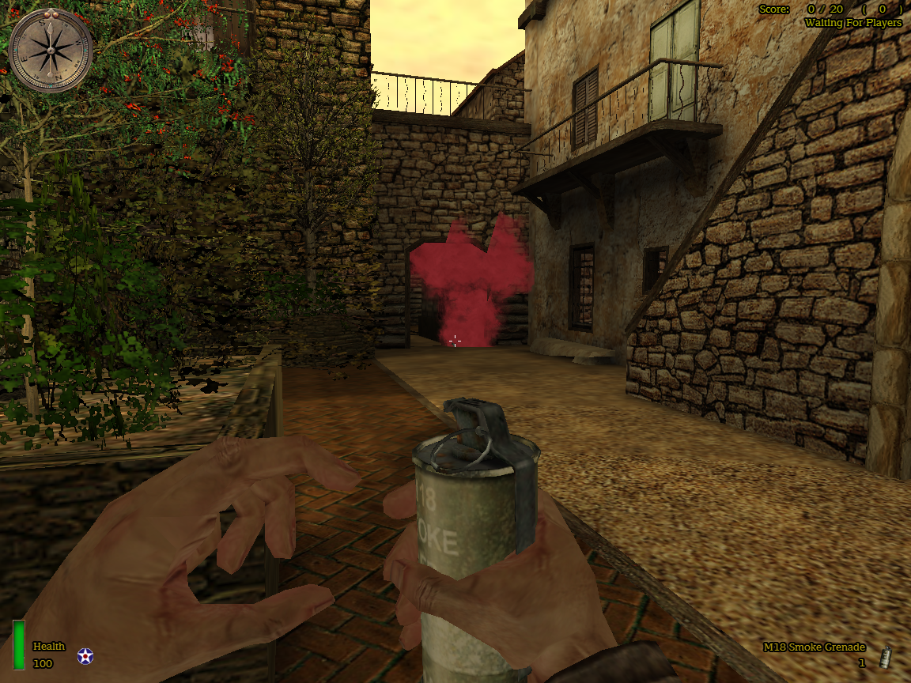
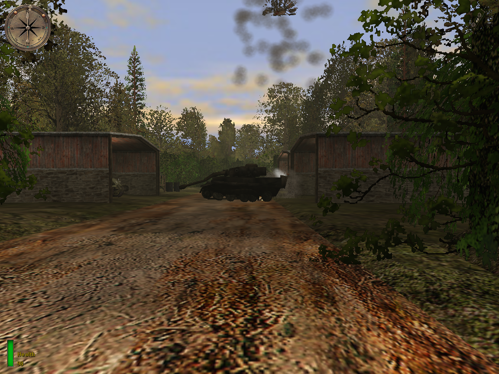
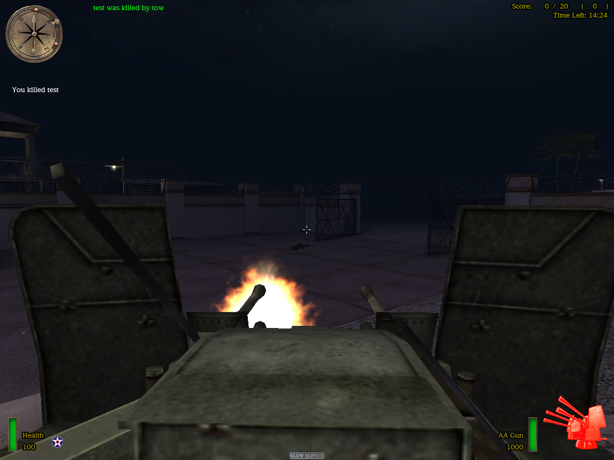
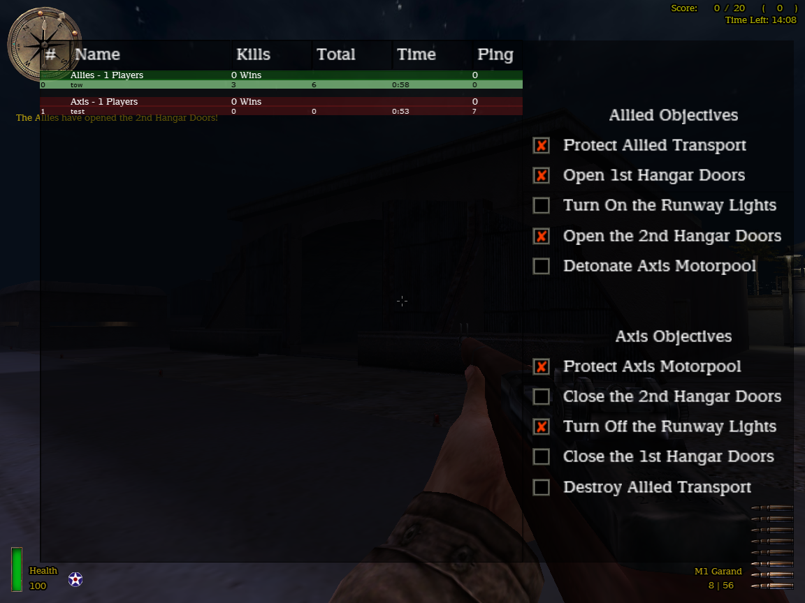
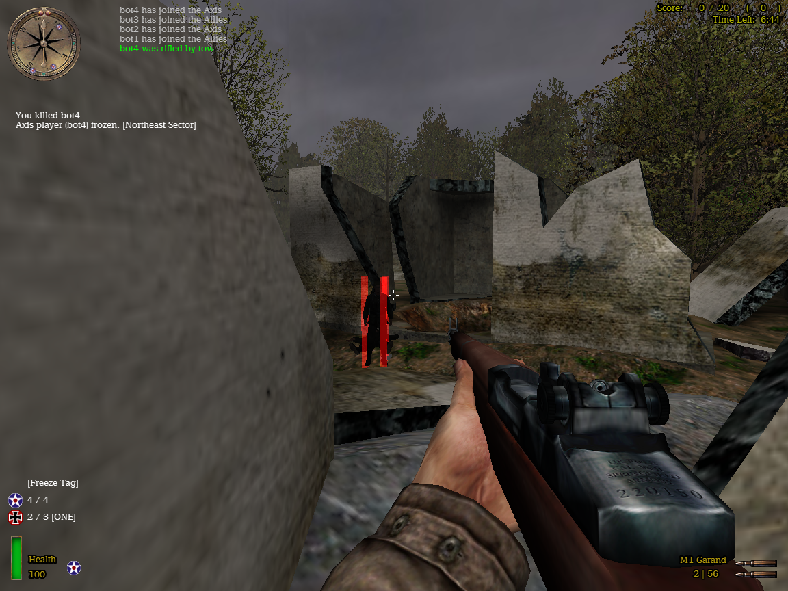
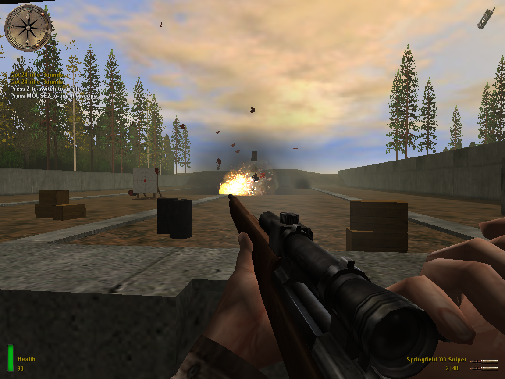

# OpenMoHAA

  

 

## What is OpenMoHAA?

OpenMoHAA is an open-source project aimed at preserving and enhancing **Medal of Honor: Allied Assault** (including Spearhead and Breakthrough expansions) by providing more features and bugfixes, across modern platforms and architectures.

Powered by [ioquake3](https://github.com/ioquake/ioq3) and the [F.A.K.K SDK](https://code.idtech.space/ritual/fakk2-sdk), OpenMoHAA provides:
- Full compatibility with the original game: assets, scripts and multiplayer
- Better support for modern systems
- Cross-platform support (Linux, Windows, macOS)
- Support for both single-player and multiplayer modes
- All fixes and features from the latest version of MOH:AAB (Allied Assault Breakthrough 2.40b)

## Getting started

- 📦 [Installation Guide](docs/markdown/01-intro/01-installation.md)
- ▶️ [Running & Expansions](docs/markdown/02-running/01-running.md)
- ❓ [FAQ & Troubleshooting](docs/markdown/02-running/03-faq.md)
- 🌐 [Hosting a server](docs/markdown/02-running/02-running-server.md)

## Reporting Issues

If you encounter a bug or a problem, you can do one of the following:
- Submit an [issue](https://github.com/openmoh/openmohaa/issues) on GitHub (use the template).
- Join the [OpenMoHAA Discord](https://discord.gg/NYtH58R) for a quick help.

## Additional documentation

- 📖 [Documentation](https://openmoh.github.io/openmohaa)
- ⚙️ [Game configuration](docs/markdown/03-configuration/01-configuration.md)
- 📝 [Code & Script documentation](docs/markdown/04-coding/02-coding.md)

## Current state

- 🧰 [Feature list](docs/markdown/01-intro/04-features.md)

### Single-player

The entire single-player campaign should work (Allied Assault, Spearhead and Breakthrough). If you encounter any bug, please create a new [GitHub issue](https://github.com/openmoh/openmohaa/issues) describing them.

### Multiplayer

- Almost fully stable
- All official game modes are supported, including those from Spearhead and Breakthrough:
  - Free-For-All
  - Team-Deathmatch
  - Round-based match
  - Objective match
  - Tug-of-War (Spearhead)
  - Liberation (Breakthrough)
- Popular mods like **Freeze-Tag** are supported
- Built-in bots for offline practice and for testing
  - 🔧 [Setting up bots](docs/markdown/02-running/01-running.md#Playing-with-bots)

You can host your own [OpenMoHAA server](docs/markdown/02-running/02-running-server.md#) or join others using OpenMoHAA.

## Screenshots

|                                                                                   |                                                                            |
|-----------------------------------------------------------------------------------|----------------------------------------------------------------------------|
|                                       |                                |
|                                    |                             |
|   |     |

*More screenshots [here](docs/assets/images)*

## Development & Compiling

- 💻 [Compiling instructions](docs/markdown/04-coding/01-compiling.md)

## Third party librairies

The following third party tools and libraries are used by the project

- [Flex](https://github.com/westes/flex)
- [Bison](https://savannah.gnu.org/projects/bison/)
- [SDL](http://www.libsdl.org/)
- [OpenAL](https://www.openal.org/)
- [LibMAD](http://www.underbit.com/products/mad/)
- [cURL](https://curl.se/)
- [Libogg](https://github.com/gcp/libogg)
- [Libvorbis](https://xiph.org/vorbis/)
- [Libopus](https://opus-codec.org/)

## Resources

- 🔗 [GitHub Repository](https://github.com/openmoh/openmohaa/)
- 🌐 [MOHAAAA Amalgamated Allied Assault Alliance](https://mohaaaa.co.uk/AAAAMOHAA/index.php)
- 🕹️ [333networks](https://333networks.com/)
- 📂 [ModDB](https://www.moddb.com/games/medal-of-honor-allied-assault)
- 📂 [GameBanana](https://gamebanana.com/games/720)
- 💬 [Join us on Discord](https://discord.gg/NYtH58R)
