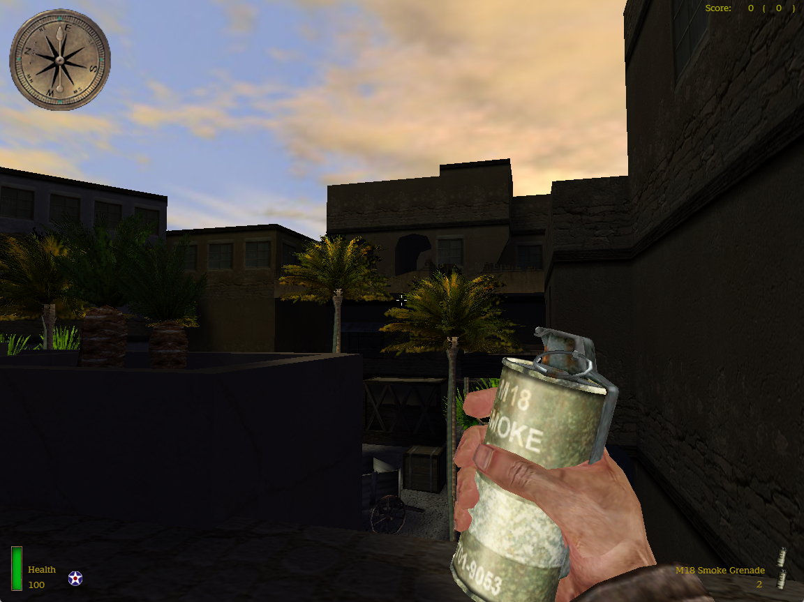

# OpenMoHAA

 [](https://github.com/openmoh/openmohaa/releases) [](https://github.com/openmoh/openmohaa/releases)

 


```
     / _ \ _ __   ___ _ __ |  \/  |/ _ \| | | |  / \      / \
    | | | | '_ \ / _ \ '_ \| |\/| | | | | |_| | / _ \    / _ \
    | |_| | |_) |  __/ | | | |  | | |_| |  _  |/ ___ \  / ___ \
     \___/| .__/ \___|_| |_|_|  |_|\___/|_| |_/_/   \_\/_/   \_\
          |_|
```

## Current State

OpenMoHAA is still in its early days. The singleplayer part is not working correctly, the current usage is multiplayer.

## Running

Backup existing mohaa files, **cgamex86.dll** and **gamex86.dll** (set their extension to **.bak**)

a) extract archive to your MOHAA installation directory.

-or-

b) Copy all pak*.pk3 files and the sound/ directory from your **MOHAA/main** directory into openmohaa's 'main' directory.

If you have problems running the game :

You may need to install Microsoft Visual C++ 2015/2017/2019/2022 Redistributable from

https://learn.microsoft.com/en-US/cpp/windows/latest-supported-vc-redist?view=msvc-170

You can now start a local OpenMOHAA server or play on a server.

To play expansions, append to the executable `+set com_target_game 1` for Spearhead, and `+set com_target_game 2` for Breakthrough. On windows you can make a shortcut.

## Builds

### Server

The server version can successfully be built.
Some stuff are not working as intended, such as Actor or Vehicle. These systems are both almost fully implemented, but not really in stable state.

Overall the server part and the game module are almost fully implemented, but the stability may vary, there may be some minor bugs and crashes.

### Client

The client version of OpenMoHAA is partially implemented and not stable currently. The cgame module is partially implemented as well, but is compatible with the original MOH:AA game. Credits to **Heavy Metal: F.A.K.K. 2**'s SDK for the cgame and fgame module.

Here is the current working state for each part of the engine:

| Part name               | Full | Almost | Half | Early | Bad | Not working | Comment                                                           |
|-------------------------|------|--------|------|-------|-----|-------------|-------------------------------------------------------------------|
| Audio                   |      |        |      |       | x   |             | Very basic implementation from Quake III                          |
| CG Module               |      | x      |      |       |     |             | Missing FX, Marks and decals                                      |
| Client                  |      | x      |      |       |     |             | Missing GameSpy, server list, binds, map picker, ...              |
| Collision               | x    |        |      |       |     |             |                                                                   |
| Model/TIKI/Skeletor     | x    |        |      |       |     |             |                                                                   |
| Renderer                |      | x      |      |       |     |             | Missing ghost, marks, sphere lights, sky portal, sun flare, swipe |
| Server                  |      | x      |      |       |     |             | Probably a few bugs remaining                                     |
| Server module (fgame)   |      | x      |      |       |     |             | Actor, vehicle, and few gameplay bugs                             |
| UI                      |      |        | x    |       |     |             | Has core features only (menu, widgets, console, hud, urc loading) |

**Medal of Honor: Allied Assault Spearhead** and **Medal of Honor: Allied Assault Breakthrough** are supported in OpenMoHAA with the `com_target_game` variable. See the **Running** section for the usage.

## Compiling

OpenMoHAA supports both x86 and x64 architectures, and although the target platform is Windows, it still can be compiled for other platforms, and even other architectures.

These are the tools required for all platforms :
- CMake >= 3.5
- Flex and Bison (currently not used)
- A C++11 compiler is required.

The installation directory can be set to MOHAA directory.

The client build can be built by adding `-DWITH_CLIENT=1` to the CMake command line. This will compile the cgame module and the full app with rendering, ui and sound suppport, alongside the dedicated server version.

### Linux

These are the tools required on Unix :
- Clang >= 3.3 or GCC >= 4.8.1

**clang-3.5** and **gcc-4.8.5** should work (tested on Ubuntu 16.04). Use the latest possible version of those compilers.

SDL2 library is required (libsdl2-dev).

1 line install command with latest clang version : `sudo apt-get install -y ninja-build cmake make clang-15 lld-15 flex bison libsdl2-dev`

Example with **CMake**, **clang-15** and **ninja-build** installed:
```sh
mkdir .cmake && cd .cmake
cmake -DCMAKE_C_COMPILER=clang-15 -DCMAKE_CXX_COMPILER=clang++-15 -DWITH_CLIENT=1 -G Ninja
```

### Windows

Visual Studio (2019 or 2022) is generally preferred.

## Screenshots

|                                                                               |                                                                 |
|-------------------------------------------------------------------------------|-----------------------------------------------------------------|
|  |                       |
|                                     |    |


## Third party

### SDL

http://www.libsdl.org/

download Source code, compile

### OpenAL

https://www.openal.org/ download OpenAL soft source

run cmake on OpenAL, compile

### LibMAD

http://www.underbit.com/products/mad/

download source code, compile

### cURL

https://curl.se/

### Libogg

https://github.com/gcp/libogg

### Libvorbis

https://xiph.org/vorbis/

### Libopus

https://opus-codec.org/

## Communities

### URLs

- https://github.com/openmoh/openmohaa/
- https://mohaaaa.co.uk/AAAAMOHAA/index.php
- https://x-null.net/

### Discord

[](https://discord.gg/NYtH58R)
